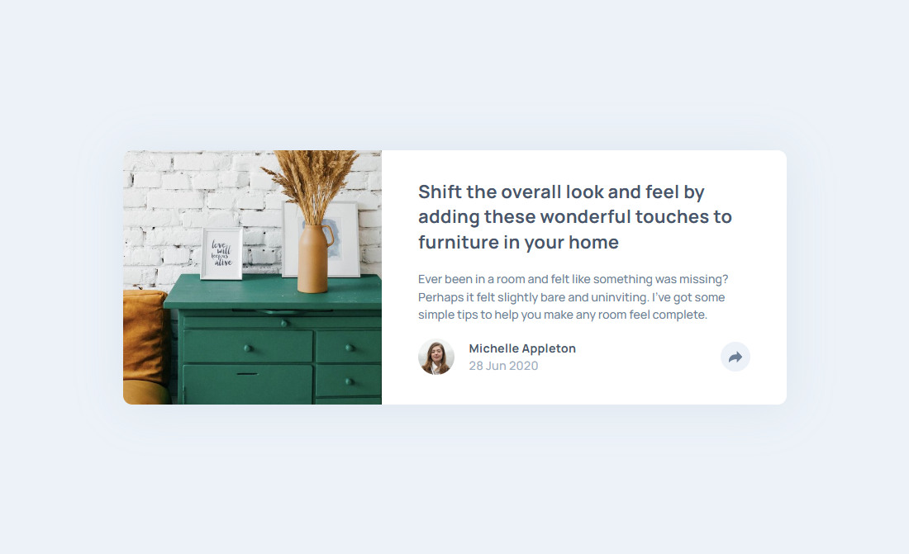
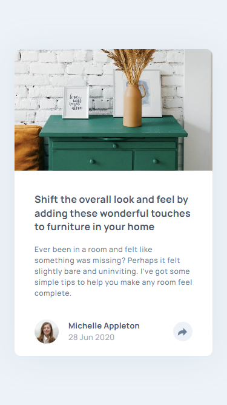

# Frontend Mentor - Article preview component solution

This is a solution to the [Article preview component challenge on Frontend Mentor](https://www.frontendmentor.io/challenges/article-preview-component-dYBN_pYFT). Frontend Mentor challenges help you improve your coding skills by building realistic projects. 

## Table of contents

- [Frontend Mentor - Article preview component solution](#frontend-mentor---article-preview-component-solution)
  - [Table of contents](#table-of-contents)
  - [Overview](#overview)
    - [The challenge](#the-challenge)
    - [Screenshot](#screenshot)
    - [Links](#links)
  - [My process](#my-process)
    - [Built with](#built-with)
    - [What I learned](#what-i-learned)
    - [Social Links](#social-links)


## Overview

### The challenge

Users should be able to:

- View the optimal layout for the component depending on their device's screen size
- See the social media share links when they click the share icon

### Screenshot

Desktop
 

Mobile


### Links

- Solution URL: [Article preview component solution](https://github.com/st0272/fm-article-preview-component)
- Live Site URL: [Article preview component solution](https://st0272.github.com/fm-article-preview-component)

## My process

### Built with

- Semantic HTML5 markup
- CSS custom properties
- Flexbox
- CSS Grid
- Mobile-first workflow
- JavaScript

### What I learned

Add a class to the button and content to display SNS icons.

```js
const shareBtn = document.querySelector(".js-shareBtn");
const shareList = document.querySelector(".js-shareList");

shareBtn.addEventListener("click", () => {
  shareBtn.classList.toggle("is-active");
  shareList.classList.toggle("is-active");
});
```

### Social Links

- Website - [Suzunatsu Website](https://www.suzunatsu.com?utm_source=gh)
- Frontend Mentor - [@st0272](https://www.frontendmentor.io/profile/st0272)
- Twitter - [@suzuantsu_](https://www.twitter.com/suzuantsu_)